# CSS-to-the-Rescue

## De opdracht

## 💡 Mijn Idee
Voor mijn opdracht gebruik ik de volgende live video mixer als inspiratie voor mijn digitale control panel:

| 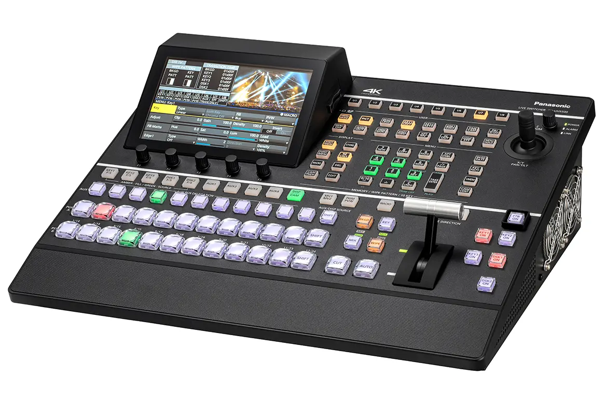 | 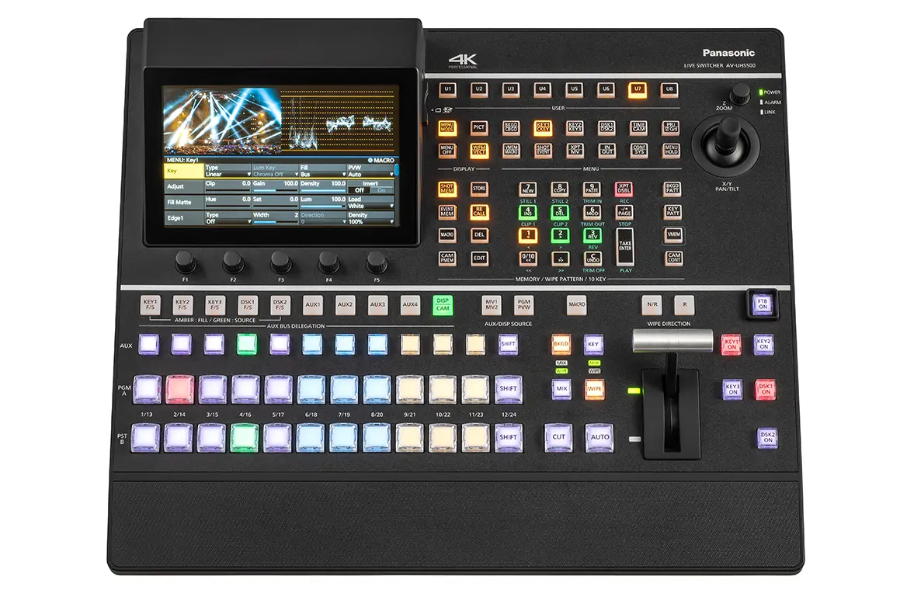 |
| --- | --- |
| Panasonic video mixer | Panasonic video mixer top view |

Het interessantste aan deze mixer vind ik de *joystick*. Daar ga ik dan ook mee beginnen. Deze zou een simpel element in het schermpje van de mixer kunnen bedienen, wat van links naar rechts en van boven naar beneden kan bewegen.

| 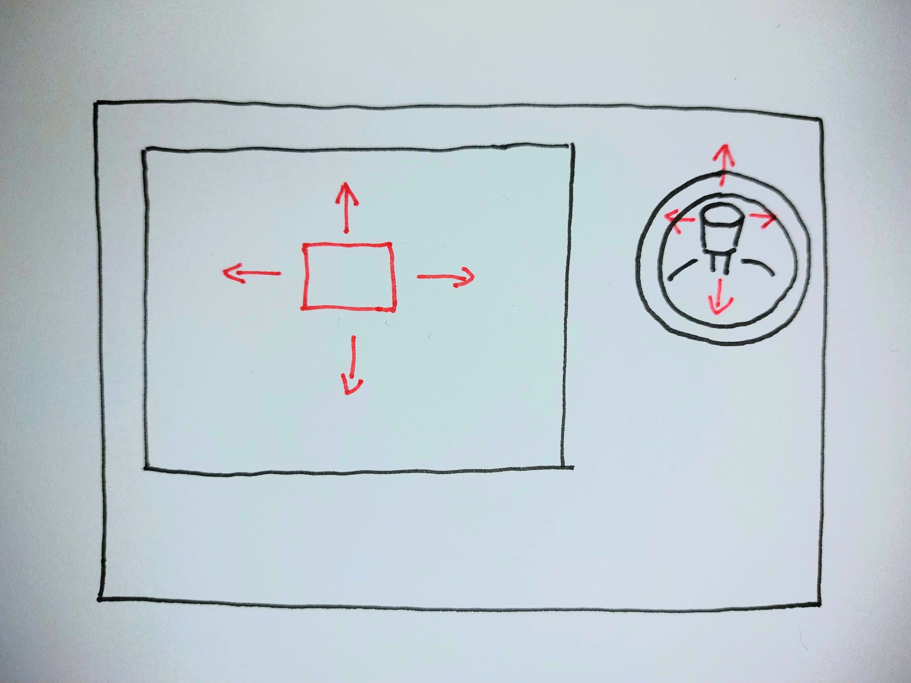 |
| --- |
| Schets van de *joystick* op de *controller* |

Als een volgende stap zou ik de *slider* kunnen maken die de overgang tussen beelden regelt. Of dat ook echt gaat gebeuren weet ik nog niet. In ieder geval kunnen de lampjes er naast wel aan of uit. De video-overgang zou simpel kunnen door de *opacity* van het ene of het andere video-element te animeren.

|  |
| --- |
| Schets van de overgang *slider* |

Later kan ik altijd nog andere elementen toevoegen zoals de draaiknopjes, die bijvoorbeeld de grootte van het element kunnen aanpassen.


## 👨‍💻 Voortgang 1 (01-03-2024)
Vandaag hebben we onze ideeën doorgesproken. Daaruit kwamen een aantal vragen en tips om te kunnen beginnen.

- Wil je dat de *joystick* weer teruggaat naar het midden of dat de *joystick* blijft staan in de positie waarin je die zet?
- Je kan de *joystick* laten werken met een aantal *buttons* eromheen. Sanne had een [voorbeeld](https://codepen.io/shooft/pen/BaEabXy) van een *D-pad* die zo werkt. Voor een *joystick* zijn er natuurlijk meer mogelijkheden voor richtingen dan 4.
- Het blokje kan je een animatie geven voor helemaal van links naar rechts. Die kan je vervolgens op pauze te zetten als er niets wordt ingedrukt en voorwaarts of achterwaarts afspelen als de *joystick* naar links of rechts gaat. Ditzelfde kan dan voor naar boven en beneden. Je kan tegenwoordig twee animaties op één element zetten, of je kan er nog een *div*-element omheen zetten.

Jop maakt toevallig ook een *joystick*, hoewel hij juist wil dat de *joystick* blijft staan als je die loslaat. Dat gaat waarschijnlijk werken met een verticale en een horizontale *slider*.


## 🕹️ De *joystick* maken

### ⚙️ Werking
| 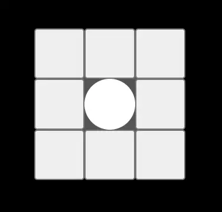 |
| --- |
| *Joystick* met 8 buttons er omheen |

De manier waarop de *joystick* werkt is dat er 8 *buttons* omheen zitten voor 8 mogelijke richtingen. Wanneer je ergens op de *joystick* klikt en over een van de buttons hovert, kan er vervolgens wat gebeuren. Dit doe ik met de volgende CSS-selector:

```css
body:has(section:nth-of-type(2) div:nth-of-type(1):active):has(section:nth-of-type(2) div:nth-of-type(1) button:nth-child(4):hover)
```

Het is een lange, maar dit zorgt ervoor dat je ook op de *joystick* kan klikken en vervolgens slepen over een van de buttons. Als de *body* een *div*-element heeft dat wordt ingeklikt en daarin een *button* heeft die wordt gehoverd, kan er vervolgens overal in de *body* wat gebeuren. Gewoon op de buttons klikken werkt op deze manier ook. De *joystick* verplaats ik vervolgens in de richting van de button.

Het **maken van het bewegende blokje** ging wat lastiger. Het idee was dat die een gepauzeerde animatie had die weer af zou spelen als de *joystick* gebruikt wordt. Als het blokje een animatie naar beneden en naar rechts had, zou die ook naar boven en naar links kunnen bewegen door de `animation-direction` op `reverse` te zetten.

Hierbij ontstonden een aantal problemen:

1. Je kan tegenwoordig **meerdere animaties op een element** zetten, maar niet als deze dezelfde *property* animeren. Nou blijkt dat `translateX()` en `translateY()` wel als een dezelfde gelden. Dit was snel opgelost door er nog een *div*je omheen te zetten met de andere animatie.
2. Wanneer een ***reversed* animatie gepauzeerd** wordt en de *reverse* er af wordt gehaald springt die naar de positie waar die zou zijn als de animatie niet *reversed* was afgespeeld.

**Dit werkt:**

https://github.com/joppekoops/CSS-to-the-Rescue/assets/112714380/b7191a2f-f196-48bf-91d4-c853a9eb6d04

**Maar dit helaas niet:**

https://github.com/joppekoops/CSS-to-the-Rescue/assets/112714380/0854d24d-f781-4e47-b2dd-14bd46d60344

Om dit nog op te lossen heb ik gezocht naar een CodePen waar het wel werkt. Deze lijkt op wat ik wil doen:
https://codepen.io/jkantner/pen/abOBdgV

Deze is wel in *Sass* geschreven en de gecompileerde CSS is heel erg lang. Sanne heeft het voor mij geabstraheerd tot alleen de kern functionaliteit:
https://codepen.io/shooft/pen/bGJVjBM
https://codepen.io/shooft/pen/zYXvLoO

### ✏️ Vormgeving
Mijn doel was om de *controller* (inclusief de *joystick*) een **3 dimensionaal** effect te geven. 

Om het **daadwerkelijk 3D** te maken, ging ik met ***perspective*** aan de gang. Eerst had ik alles een *perspective* gegeven, maar hierdoor werkte niet alles zoals het hoort te werken. Hier kwam ik achter omdat de onderkant van de controller niet goed gedraaid wilde worden.

| 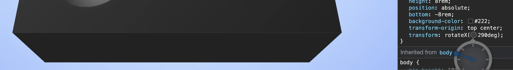 |
| --- |
| Onderkant die niet goed draait |

In plaats van dat die 90° ten opzichte van de hele controller gedraaid moest worden, was dit 70°. Het kwam er op neer dat ik 3D niet goed begreep. Voor 3D in CSS, geef je alleen de hele scene of het hele object een `perspective`. Vervolgens moeten alle element hierin die ook 3D zijn `transform-style: preserve-3d;` krijgen. Er zijn nog een aantal dingen waarmee dit niet samen kan, zie het volgende artikel: 
https://css-tricks.com/things-watch-working-css-3d/

Iets 3 dimensionaals lijkt niet echt 3D zonder dat de **belichting** klopt. Hiervoor heb ik op belichte vlakken ***gradients*** gebruikt. Deze zijn heel subtiel, maar net genoeg om het een beetje glanzend te laten lijken.

Zo ging ik van ongestijld, naar meer realistisch:

|  | 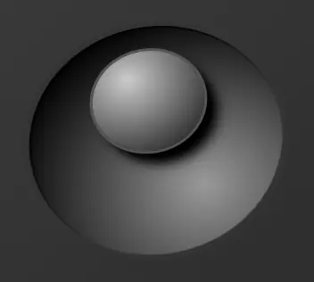 |
| --- | --- |
| *Joystick ongestijld* | *Joystick 3D gestijld* |

Verder wilde ik nog een patroontje toevoegen, zoals ook op de originele foto van de mixer. Hiervoor heb ik verschillende dingen geprobeerd in deze *CodePen*: https://codepen.io/jkhvacmd/pen/rNbVQeB, maar alles werd nog te veel herhalend.


De *joystick* is nog niet helemaal af. Hij moet nog een steeltje hebben om er helemaal logisch uit te zien. Nu is het een soort zwevende control. Bovendien moet de werking nog gefixt. Gelukkig heb ik inmiddels een voorbeeld waar dit wel werkt.


## 👨‍💻 Voortgang 2 (08-03-2024)
Vandaag hebben we laten zien hoe ver we waren met het maken en wat we er verder nog mee gaan doen.

Ik ga beginnen met het steeltje maken voor de *joystick* en het aanpassen van de functionaliteit naar de manier waarop het voorbeeld wat ik had gevonden het deed. Dit kan op twee manieren:

- Het kan zoals ik nu heb met twee *div*jes.
- Het kan ook door de animaties bij elkaar op te tellen met *animation compositions*.

Iets anders wat ik nog toe kan voegen is kleine animaties op de *joystick*. Bijvoorbeeld dat als die terugspringt dat die dan even *bounced*. Dit kan met CSS *linear timing functions*: `linear()`.


## 🔧 *Joystick* verbeteren

### ⚙️ Nieuwe functionaliteit
De nieuwe werking van het verplaatsen was niet zo ingewikkeld om toe te passen. Veel paste in de code die ik al had. De bestaande animaties kon ik verwijderen, want die had ik niet meer nodig.

Nu is het wel mogelijk om in beide richtingen te bewegen. Een nadeel is wel dat hoe dichter je al bij een kant zit, hoe langzamer die er heen beweegt.

### 🏑 Het steeltje
Simpel gezien is het steeltje van de *joystick* een kleine cilinder. Nou is een rond 3D object in CSS niet zo simpel. Je kan niet echt gebogen vlakken maken, dus het idee is om veel rechte vlakjes als koordes in een cirkel te zetten.

De circel wordt gegeven door een straal. Aan de hand van die straal kan ik vervolgens berekenen wat de breedte van de vlakjes moet zijn door sinus te gebruiken:

```CSS
ul {
	--face-width: calc(2 * var(--radius) * sin(360deg / var(--faces) / 2));
}
```

Hierin is 360° gedeeld door het aantal vlakken de hoek van een vlakje. Deze deel ik door twee zodat ik een rechthoekige driehoek maak van een kant van de driehoek tussen twee stralen en de koorde. Hierin weet ik de straal en de hoek, dus kan ik met sinus de overstaande zijde berekenen door de straal / de schuine zijde keer de sinus van de hoek te doen. Zie ook de volgende tekening:

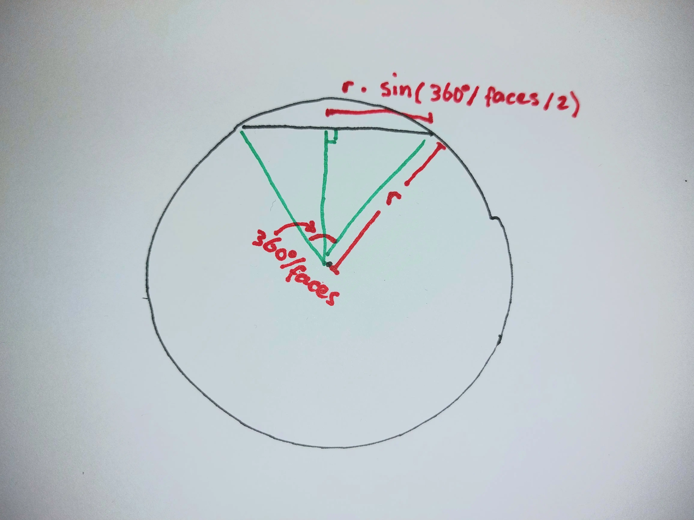

Dit ging redelijk makkelijk. Vervolgens heb ik alle vlakjes gedraaid tot een bepaalde hoek, door weer 360° te delen door het aantal vlakjes. Daarna heb ik alle vlakjes de lengte van de straal naar buiten verplaatst. Dit lijkt eerst goed te gaan, maar zodra ik een boven en onderkant had toegevoegd, zag ik het probleem: de vlakjes staken uit, waardoor er spleten ontstonden.

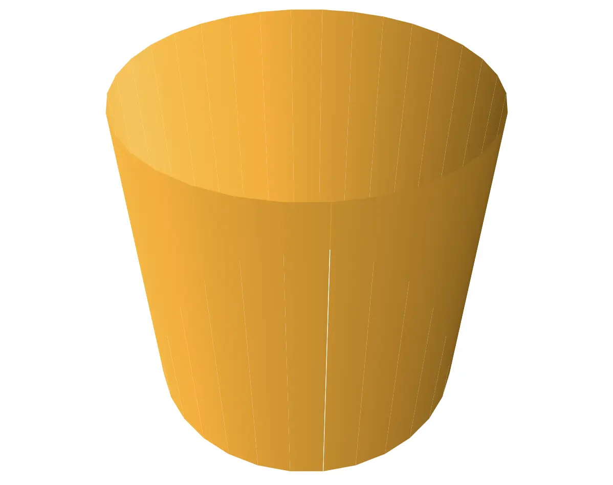

Dit kwam omdat de vlakjes iets naar binnen moesten staan, zodat de uiteinden op de straal kwamen te staan. Deze afstand kon ik gemakkelijk op een zelfde manier berekenen als de breedte van de vlakjes, maar dan nu met cosinus:

```CSS
ul {
	 --face-distance: calc(var(--radius) * cos(360deg / var(--faces) / 2));
}
```

Ook moest er nog wat schaduw op het steeltje. Dit heb ik gedaan door elk vlakje een gradient te geven, die steeds iets donker werd. De gradient van elk vlakje moest wel weer op de volgende aansluiten. Hierdoor krijg je de volgende code:

```CSS
li {
	background-image: linear-gradient(to right, hsl(var(--h), var(--s), calc(var(--l) * .8)), hsl(var(--h), var(--s), calc(var(--l) * .75)));
}
```

Zie deze CodePen: https://codepen.io/jkhvacmd/pen/MWRyXLO

Deze code was wel erg lang en herhaalt veel, dus na een puzzeltje heb ik er de volgende code van gemaakt, waarin aan de hand van de index van het vlakje de kleur en positie wordt berekend:

```CSS
li {
	transform: rotateY(calc(360deg / var(--faces) * var(--index))) translateZ(var(--face-distance));
  		background-image: 
  			linear-gradient(
	  			to right, 
	  			hsl(
	  				var(--h), 
	  				var(--s), 
	  				calc(var(--l) * (((abs((var(--index) - 1) - .5 * var(--faces)) / var(--faces) - .5)) + 1))
	  			), 
	  			hsl(
	  				var(--h), 
	  				var(--s), 
	  				calc(var(--l) * (((abs((var(--index) + 0) - .5 * var(--faces)) / var(--faces) - .5)) + 1))
	  			)

  			)
  		;
}
```

https://codepen.io/jkhvacmd/pen/yLrJemN

Omdat ik hier gebruik maak van ```abs()``` werkt dit helaas alleen in Firefox. Helaas werken andere dingen die ik nodig heb juist niet in Firefox, dus hier zou ik het liefst nog een oplossing voor vinden.


## De titel
Voor de titel wilde ik iets dat van metaal lijkt te zijn. Het effect wat ik heb gemaakt, bestaat uit 3 lagen van gradients om samen een metaal effect te maken.

| 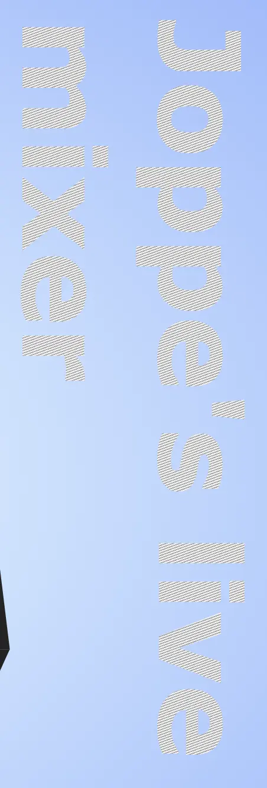 | 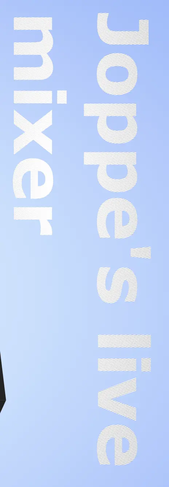 | 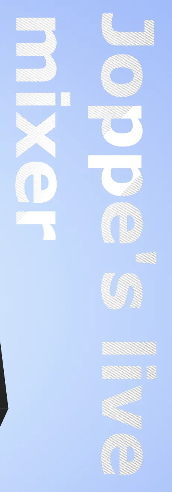 | 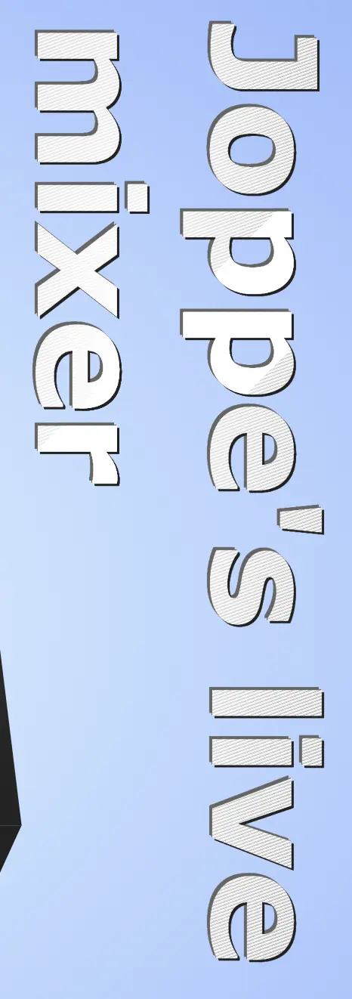 |
| --- | --- | --- | --- |
| Eerste laag: streepjes voor het geborstelde effect | Tweede laag: wit naar transparant voor belichting | Derde laag: witte streep voor licht reflectie | Vierde laag: 2 *drop-shadow* filters voor rand met glimmertje |


## Responsive