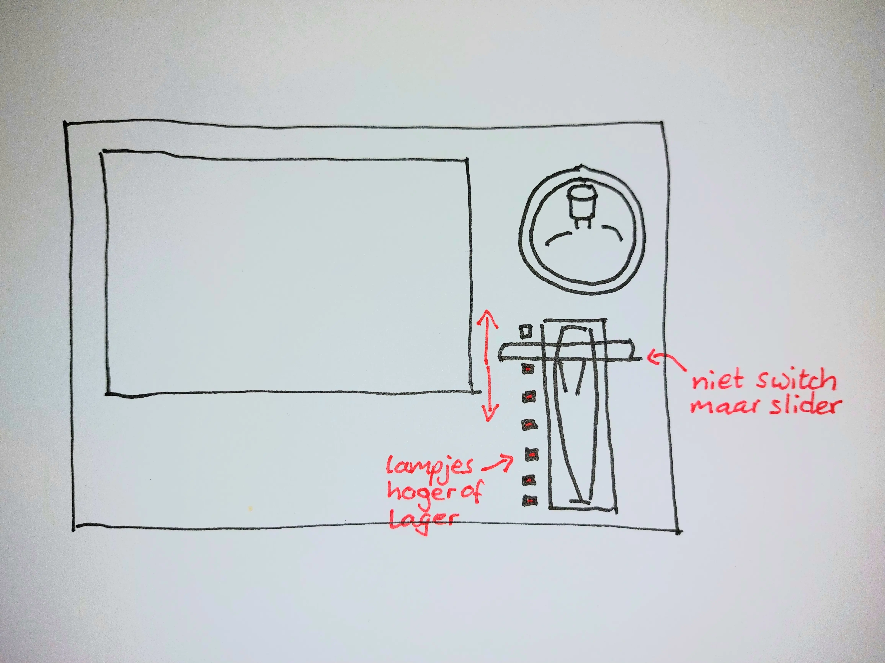

# CSS-to-the-Rescue

## 💡Mijn Idee
Voor mijn opdracht gebruik ik de volgende live video mixer als inspiratie voor mijn digitale control panel:

|  |  |
| --- | --- |
| Panasonic video mixer | Panasonic video mixer top view |

Het interessantste aan deze mixer vind ik de *joystick*. Daar ga ik dan ook mee beginnen. Deze zou een simpel element in het schermpje van de mixer kunnen bedienen, wat van links naar rechts en van boven naar beneden kan bewegen.

|  |
| --- |
| Schets van de *joystick* op de *controller* |

Als een volgende stap zou ik de *slider* kunnen maken die de overgang tussen beelden regelt. Of dat ook echt gaat gebeuren weet ik nog niet. In ieder geval kunnen de lampjes er naast wel aan of uit. De video-overgang zou simpel kunnen door de *opacity* van het ene of het andere video-element te animeren.

|  |
| --- |
| Schets van de overgang *slider* |

Later kan ik altijd nog andere elementen toevoegen zoals de draaiknopjes, die bijvoorbeeld de grootte van het element kunnen aanpassen.